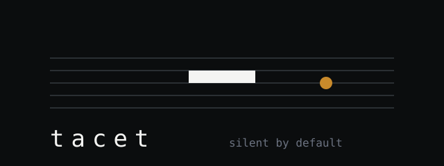

<div align="center">



**Silent by default.**

An agent that sits in your meetings, listens to everything, speaks only when called, and files the minutes.

[](LICENSE)
[](https://bun.sh)
[](#install)

</div>

---

*tacet* (TAY-set) is the instruction on a score that tells an instrument to stay
silent for the whole movement. It plays nothing until the piece calls for it.

That is the entire design. Meeting bots that talk are worse than no bot at all,
so this one is mute by construction: seven independent gates stand between an
utterance and a spoken reply, and the language model does not get a vote on any
of them. It decides *what* to say. Whether it may speak at all is decided in
[`src/core/floor.ts`](src/core/floor.ts), in code you can read in five minutes.

Meanwhile it writes everything down — decisions, action items and open questions,
extracted while the meeting is still running, so a crash costs you nothing and
someone joining late can ask where things stand.

## What it does

- **Joins a meeting** as a participant, through a transport you control.
- **Stays silent** until someone says its name. Then a short window opens, and
  inside that window you can keep talking to it without repeating the name.
- **Answers from the conversation** in about a second, and reaches for real data
  only when the question needs it — announcing that it is looking, so nobody is
  left wondering whether it heard.
- **Takes notes as it goes.** "That's a decision: we ship on the twentieth" is
  recorded verbatim, instantly, with no model in the loop.
- **Goes off the record** when asked: the words are dropped from the transcript,
  from the notes and from every delivery, including the sentence said while the
  command was still landing. What it cannot do is silence the transport — see
  [SECURITY.md](SECURITY.md).
- **Files the minutes** at the end: Markdown, PDF, and anywhere else you point it.

## Install

```bash
git clone https://github.com/leonardocandiani/tacet
cd tacet
bun install
bun link            # puts `tacet` on your PATH
tacet init
```

Edit `tacet.json`, export the keys it names, then:

```bash
tacet check            # config, wake word and credentials — no network calls
tacet check --live     # additionally makes every provider answer for itself
tacet join https://meet.google.com/abc-defg-hij
```

`check` refuses a wake word that collides with ordinary speech, which is the
single most damaging thing you can misconfigure. `--live` costs a few tokens and
one word of synthesised audio, and it is the difference between "the file parses"
and "this will work at ten tomorrow".

You also need a meeting transport. The shipped adapter targets a self-hosted
[Vexa](https://github.com/Vexa-ai/vexa) deployment, which runs the browser that
actually joins the call — [docs/transports.md](docs/transports.md) has the
compose-up-and-get-a-key walkthrough.

PDF minutes need a Chromium-based browser on the machine (Chrome, Chromium, Edge
or Brave). Without one, everything else still works and the PDF is skipped with a
line in the log.

Prefer not to install anything? `bun run src/cli.ts <command>` works exactly the
same, and the documentation writes `tacet` for brevity.

### Teaching a coding agent to drive it

There is a skill in [`skills/tacet`](skills/tacet/SKILL.md) that hands an agent
the operating knowledge: how to pick a wake word, what to check before joining,
and how to diagnose the two complaints that actually happen.

```
npx skills add https://github.com/leonardocandiani/tacet
```

Claude Code can install it as a plugin instead:

```
/plugin marketplace add leonardocandiani/tacet
/plugin install tacet
```

## Configure

One file describes what you want. Secrets stay in the environment, referenced by
variable name — the config is safe to commit and review.

```jsonc
{
  "name": "Nova",                       // also the wake word
  "wakeAliases": ["novah", "nowa"],     // spellings your recogniser actually produces
  "language": "en",

  "transport": { "use": "vexa", "baseUrl": "http://localhost:18056", "keyEnv": "VEXA_API_KEY" },

  "fast": [                             // tried in order; first one that answers wins
    { "use": "gemini", "model": "gemini-2.5-flash", "keyEnv": "GEMINI_API_KEY" },
    { "use": "openai", "model": "gpt-4o-mini", "keyEnv": "OPENAI_API_KEY" }
  ],

  "deep": [                             // optional: slow, and allowed to use your tools
    { "use": "command", "argv": ["claude", "-p"], "timeoutMs": 120000 }
  ],

  "voice": [{ "use": "elevenlabs", "keyEnv": "ELEVENLABS_API_KEY" }],
  "sinks": [{ "use": "files", "dir": "./meetings" }],

  "floor": { "windowSeconds": 45, "cooldownSeconds": 10, "maxTurns": 20 }
}
```

The `command` brain is the reason this is useful inside a company: point it at an
agent that already has your tools and your data, and it answers questions about
your business in the meeting. tacet never needs to know what those tools are.

## Talking to it

| You say | It does |
|---|---|
| "Nova, what did we decide about pricing?" | answers from the conversation |
| "…and what about the timeline?" | answers too — inside the window, no name needed |
| "Nova, that's a decision: budget stays at fifteen thousand" | records it verbatim, instantly |
| "Nova, action item: Review the leads (Sam, Friday)" | records the task, the owner and the deadline |
| "Nova, where are we?" | counts what is settled and what is still open |
| "Nova, off the record" | stops writing anything down until told otherwise |
| "Nova, quiet" | closes the window; still listening |
| "Nova, go to sleep" | mutes for the rest of the meeting |

## The seven gates

Between hearing something and saying something:

1. **Silent by default** — it starts mute and stays that way.
2. **Addressed or nothing** — the wake word, or a reply inside a window it opened.
3. **The model may decline** — `NO_REPLY` when the line was not really for it.
4. **Voice override** — "quiet" and "sleep" work immediately, ahead of everything.
5. **Cooldown** — a minimum gap between turns, so it cannot monologue.
6. **Turn budget** — a hard ceiling per meeting, with no runtime override.
7. **Barge-in** — someone talks over it, it stops mid-sentence.

A question refused for timing is held, not dropped, and delivered when the floor
reopens — unless the room has moved on, in which case it is discarded rather than
answered late. Going off the record counts as the room moving on.

One deliberate exception: a confirmation like "Noted." skips the cooldown, because
a capture that answers four seconds later gets repeated by whoever dictated it. It
does **not** skip the turn budget. With a budget of zero there is no confirmation
and no channel through which the agent says anything at all.

## Architecture

```
transport  ──► utterances ──► settle ──► floor ──► brain ──► voice ──► transport
   (join, listen, speak)         │         │
                                 │         └── commands: capture, status, privacy
                                 └── notebook ──► minutes ──► sinks
```

Everything crossing a boundary goes through an adapter, and every seam but one
ships with at least two implementations:

| Seam | Ships with |
|---|---|
| Transport | Vexa — the only one today, see [docs/transports.md](docs/transports.md) |
| Brain | OpenAI (and any compatible endpoint), Anthropic, Gemini, **any local command** |
| Voice | ElevenLabs, OpenAI, any HTTP endpoint, silent |
| Sink | files, webhook, command, memory |

One transport is not a fallback, and that is the seam worth writing next.
Everywhere else the config takes a list and tries each in order, so a provider
outage costs a retry rather than the meeting.

Adding one is a function and a `case`. See [docs/adapters.md](docs/adapters.md).

## What it deliberately does not do

Some of these are the most requested features in this category. Each one was
considered and rejected, with reasons in [docs/decisions.md](docs/decisions.md).

- **No always-on mode.** One false positive in a client meeting costs more than
  every correct answer that week is worth.
- **No proactive corrections.** Interrupting someone to say their number is wrong
  is public humiliation with a nice UI.
- **No sentiment or engagement scoring.** Fragile measurement, presented as data,
  about people, in a document that outlives the meeting.
- **No voice cloning.** Not of participants, not of anyone.
- **No talk-time leaderboards** by default.

## Security

The agent is in the room with everything anyone says, and the `command` brain can
put that in front of a process holding your tools. [SECURITY.md](SECURITY.md)
describes what leaves the machine, how third-party speech is fenced before it
reaches a model, and how to run that brain without handing the meeting your
credentials.

## Documentation

- [Wake words](docs/wake-word.md) — why the name matters more than it sounds
- [Audio windows](docs/audio-windows.md) — the setting that governs transcript quality
- [Adapters](docs/adapters.md) — writing your own
- [Transports](docs/transports.md) — getting a bot into the room
- [Decisions](docs/decisions.md) — what was rejected and why
- [Security](SECURITY.md) — threat model, and the limits of "off the record"

## Development

```bash
bun run check     # typecheck, lint and tests
```

The floor logic and the notebook are pure functions with no I/O, and they are
tested as such. If you change how the agent decides to speak, the tests in
`src/core/floor.test.ts` are the specification.

## License

MIT © Leonardo Candiani
